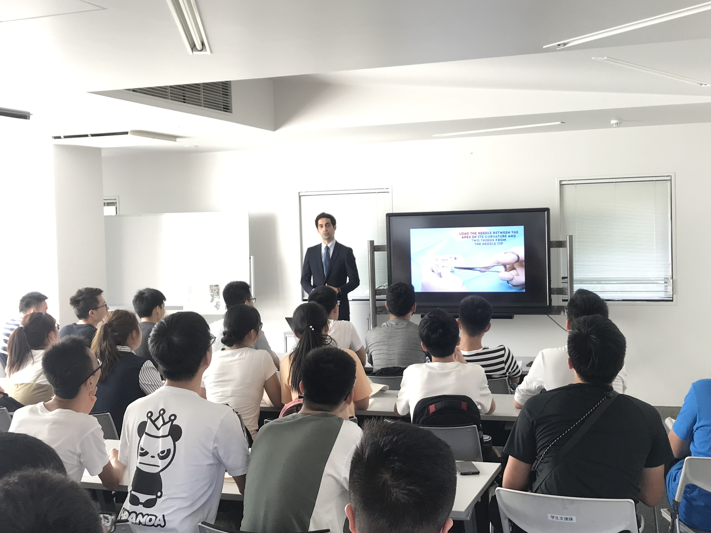

In this talk, I made a brief introduction on surgery, minimally invasive surgery, and robot assisted minimally invasive surgery. After introducing some of the unsolved problems regarding surgical robots, I showed what we have been doing at the Mitsuishi-Harada laboratory to solve those issues. Lastly, I presented some of my own research.

This talk was given in three ocasions, once on July 17th and twice on July 27th. These talks were organized by the Association of Chinese Students of the University of Tokyo.
